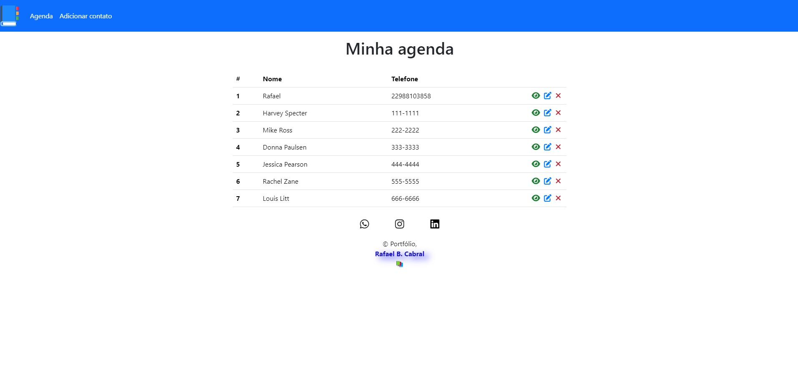

<h1 align="center">
<p ><b> <b style="text-decoration: none; color: #007bff">Agenda </b>Telefonica 🤳🏻📲<b></p>


<br>
</h1>


<a href="https://abrir.link/WjnrO" style="text-decoration: none; color: #007bff;">
📘 Para explorar o site, clique aqui!</h2>
</a>


## 📖 Sobre

#### Este site é uma agenda de contatos online, ideal para quem deseja armazenar e gerenciar suas informações de contato de forma prática e acessível. Desenvolvido com HTML, CSS, JavaScript, PHP e mySQL. Ele oferece uma interface amigável e intuitiva, permitindo que você cadastre, visualize e edite seus contatos com facilidade. O site funciona de forma responsiva, adaptando-se perfeitamente a diferentes dispositivos, como computadores, tablets e celulares. Isso garante que você possa acessar sua agenda e consultar seus contatos independentemente do aparelho que estiver utilizando.


## 🔨 Ferramentas

- [HTML5](https://www.w3schools.com/html/)
- [CSS3](https://www.w3schools.com/css/)
- [PHP](https://www.w3schools.com/php/)
- [MYSQL](https://www.w3schools.com/mysql/)

## 🕹️  Funcionalidades

- **Cadastro de Contatos:** Adicione novos contatos à sua agenda informando o nome, telefone e observações adicionais.

- **Visualização de Contatos:** Acesse a lista completa de contatos cadastrados, podendo filtrá-los e ordená-los de acordo com suas necessidades.

- **Edição de Contatos:** Atualize as informações de seus contatos sempre que necessário, garantindo que seus dados estejam sempre precisos.

- **Exibição de Detalhes:** Visualize os detalhes de cada contato, incluindo nome, telefone e observações.

- **Exclusão de Contatos:** Remova contatos que não sejam mais necessários da sua agenda.

- **Pesquisa:** Busque por contatos específicos utilizando critérios como nome, telefone ou palavras-chave nas observações.

- **Interface Responsiva:** Acesse sua agenda e gerencie seus contatos a partir de qualquer dispositivo, seja computador, tablet ou celular.

## ♻️ Como contribuir para este projeto

```bash
# Clone o projeto
$ git clone https://github.com/rafaelbcabral/agenda-telefonica.git
````
<br>

````bash
# Entrar no diretório
$ cd agenda-telefonica
````
<br>

````bash
# Instalar as dependencias, caso use npm
$ npm install
````

<p style="text-align: center; font-size: 15px; "><b>OR</b></p>

````bash
# Caso use Yarn
$ yarn
````

<h1></h1>
<p style="text-align: center; font-weight: bold; font-size: 20px">End</p>

